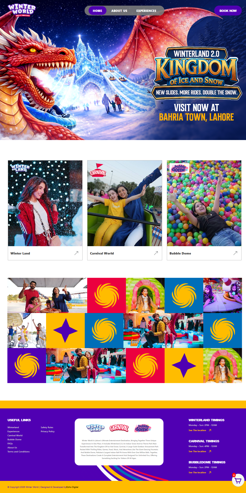

# Static to React Conversion — Winter World

Welcome to the Winter World React application! This project demonstrates migrating a static web layout into a modern, component-driven architecture using React and Vite. It covers structured component separation, handling dynamic static asset paths, and implementing fluid responsive layouts.


## Table of Contents

1. [Live Demo](#live-demo)
2. [Folder Structure](#folder-structure)
3. [Core Components](#core-components)
4. [Official Documentation & Resources](#official-documentation--resources)
5. [Getting Started](#getting-started)
6. [License](#license)
7. [Author](#author)

## Live Demo

Click the preview image below to visit the live interactive demo:

[](https://hadiashah01.github.io/static-to-react/)


## Folder Structure

```text
static-to-react/
└── static-to-react/      
    ├── public/              
    ├── src/                
    │   ├── assets/        
    │   ├── components/           
    │   ├── index.css        
    │   └── main.jsx          
    ├── package.json          
    └── vite.config.js        
```

## Core Components

Below are the key modular building blocks mapped directly to their corresponding source code within this repository:

- [**Header Component**](./static-to-react/src/components/Header.jsx): Implements responsive site navigation links and embeds modern brand identity hooks.

- [**Main Body Component**](./static-to-react/src/components/MainOfBody.jsx): Hosts high-performance grid galleries, interactive service cards, and embedded responsive vector paths.

- [**Footer Component**](./static-to-react/src/components/Footer.jsx): Contains navigational link groups, timing schedules for individual sections, and developer credit references.


## Official Documentation & Resources

To understand the core ecosystem driving this transformation, consult the official framework guidelines:

- [**Official React Documentation**](https://react.dev/): Guide on component structures, state models, and JSX rules.

- [**Vite Environment Guide**](https://vite.dev/guide/): Optimizing module bundles and managing local hot asset swapping.

- [**Node.js Runtime Platform**](https://nodejs.org/docs/): Reference for local runtime compilation tools.

## Getting Started
Prerequisites
Make sure you have Node.js installed on your machine.

## Installation & Run
Clone this repository:

```bash
git clone https://github.com/hadiashah01/static-to-react.git)
```

Navigate into the configuration subdirectory:

```Bash
cd static-to-react/static-to-react
```

Install the required dependencies:

```Bash
npm install
```

Fire up the local Vite developer environment:

```Bash
npm run dev
```


## License

This project is licensed under the terms of the MIT License. You are free to modify, distribute, and build on top of this source code.

## Author

Hadia Shahjahan

GitHub: [@hadiashah01](https://github.com/hadiashah01/)
